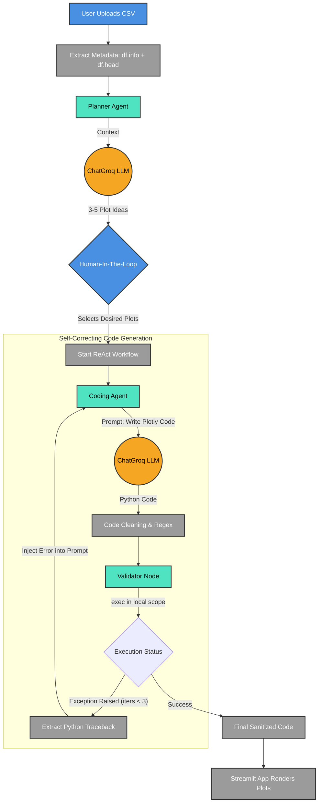

# AI-Powered Data Dashboard with Agentic Workflow

An interactive data visualization dashboard built with Streamlit, LangGraph, and ChatGroq. This project utilizes a multi-agent architecture to autonomously suggest, generate, and validate Plotly code based on user-uploaded datasets.

## Architecture & Agentic Flow

The system separates the reasoning tasks from the coding tasks, utilizing a Human-In-The-Loop (HITL) step and a self-correcting ReAct (Reason + Act) validation loop to ensure reliable code generation.



### Agent Roles

1. **Planner Agent:**
* **Role:** Data Analyst.
* **Function:** Receives only the data schema and a small sample (metadata). It analyzes the data types and distribution to suggest 3-5 mathematically and logically sound visualization ideas.


2. **Coding Agent:**
* **Role:** Python/Plotly Expert.
* **Function:** Takes the user's approved suggestions and generates strictly formatted `plotly.express` code. It is instructed to avoid markdown wrappers and rendering commands (`fig.show()`).


3. **Validator Node (The ReAct Loop):**
* **Role:** Quality Assurance / Execution Sandbox.
* **Function:** Uses Python's `exec()` command in an isolated scope to test the LLM's code against the actual dataframe. If a syntax error, `KeyError`, or `ValueError` occurs, it captures the exact traceback and loops it back to the Coding Agent for autonomous fixing (up to 3 iterations).


## Features

* **Privacy First:** Only table metadata (columns, types, top 3 rows) is sent to the LLM. The full dataset remains local.
* **Resilient Code Execution:** Failsafes like regex stripping and LangGraph validation loops prevent app crashes from bad LLM outputs.
* **Human-in-the-Loop:** The AI suggests, but the human decides. The agent pauses execution until the user selects the plots they want.
* **Native Streamlit Integration:** Charts are rendered seamlessly in Streamlit's native layout without popping up external browser tabs.

## Getting Started

### Prerequisites

* Python 3.10+
* [uv](https://github.com/astral-sh/uv) (Extremely fast Python package installer and resolver)
* A [Groq API Key](https://console.groq.com/)

### Installation

1. Clone this repository or initialize a new directory.
2. Initialize the project with `uv`:
```bash
uv init data_agent_project
cd data_agent_project


```


```
3. Install the required dependencies:
   ```bash
   uv add streamlit langchain-groq langgraph pandas plotly
   

```

### Setup

1. Open `app.py`.
2. Locate the LLM initialization and insert your Groq API key:
```python
llm = ChatGroq(temperature=0, model_name="llama-3.3-70b-versatile", groq_api_key="YOUR_GROQ_API_KEY")


```


```
   *(Alternatively, configure this via environment variables using `.env` for better security).*

### Usage

Run the Streamlit application:
```bash
uv run streamlit run app.py

```

1. Upload a valid CSV file.
2. Click **Analyze Data** to trigger the Planner Agent.
3. Select your preferred visualizations from the AI's suggestions.
4. Click **Generate Selected Plots**. Watch the terminal to see the ReAct loop catch and fix errors in real-time if the LLM makes a mistake!

```
